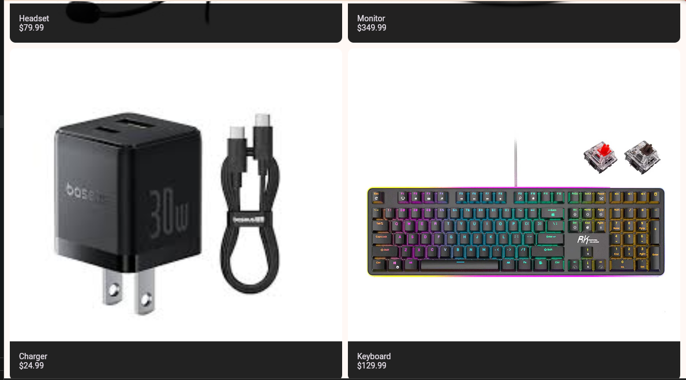
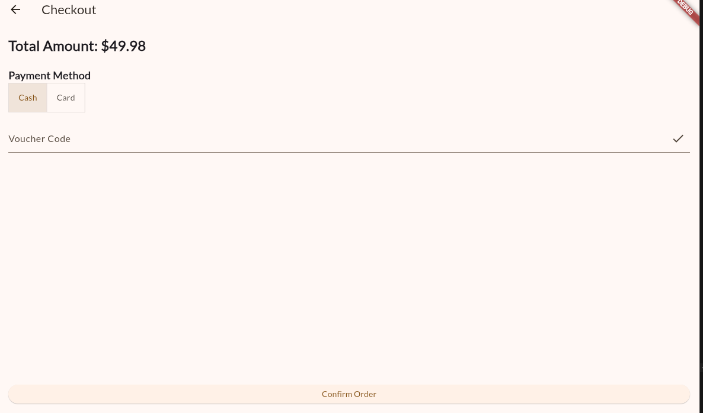
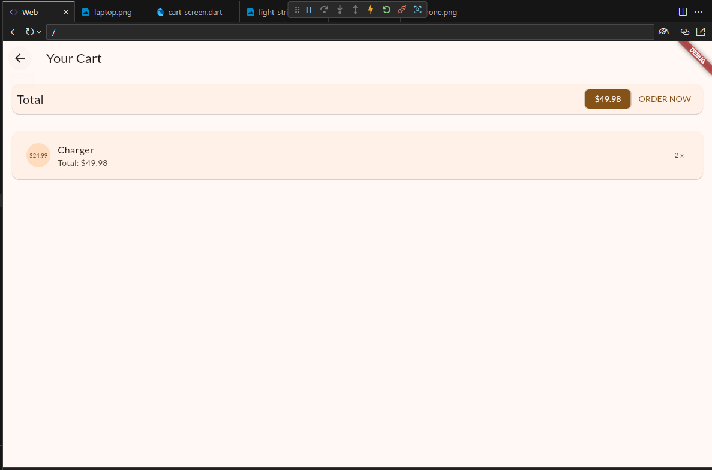
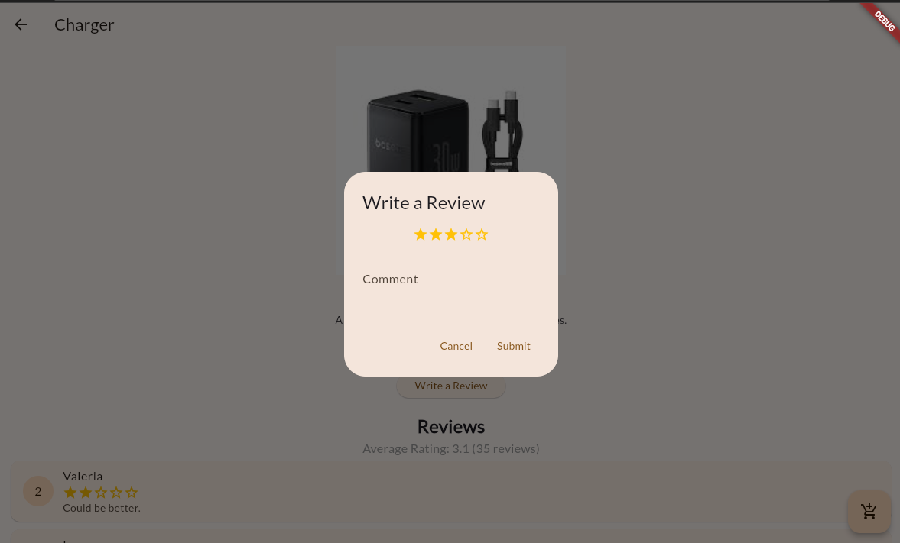
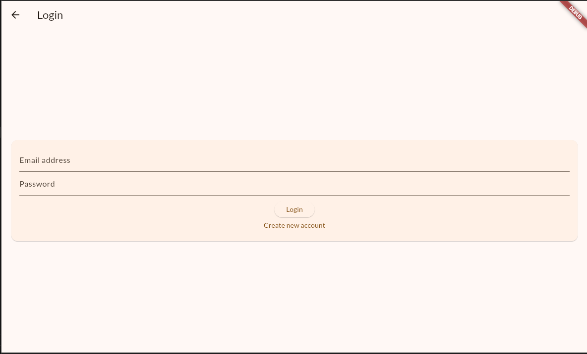

# Mobile App-Final Project

## Author: Juan Miguel G. Francisco

 

Description:This project is a simple, online e-shopping website 
 

## Features

*   **Browse through items**: There are items on the homepage where the user can scroll and browse through, they can click on the item name so they can see the item description and reviews as well as order it and add it to the cart

*   **Search items**: A simple search bar where the user can type in an item name and it will filter and pop that specific item

*   **Order items**: Once you picked and item and put it on the cart, you can order it and chose if youre going to use cash or card, as well as put in a voucher (put juanisawesome for a 67% discont) then you can order it 

*   **Shopping Cart**: This is where the items you are planning to buy will go, either press order now to go to the checkout page to order the items or swipe the items to the left to delete them

*   **Write a review**: You can write a review for the item that you bought and you can see what reviews others have wrote. Note that you can only write a review if you have ordered the item. 

*   **Login and create an account**: A simple login and sign up account.

 

## Sample Output Screenshots

Here are screenshots demonstrating the flow and functionality of the application.

 

### 1. Browse through items

*(A screenshot of the main menu options)*

 

### 2. Search items

*(A screenshot showing the process of adding a couple of books)*

 

### 3. Order items

*(A screenshot showing the list of books before sorting)*

 

### 4. Shopping Cart

*(A screenshot showing the message after sorting and the newly sorted list)*

 

### 5. Write a review

*(A screenshot of the output when searching for a book that exists)*

 

### 6. Login and create an account

*(A screenshot showing a book being added to the order queue and then processed)*

 
